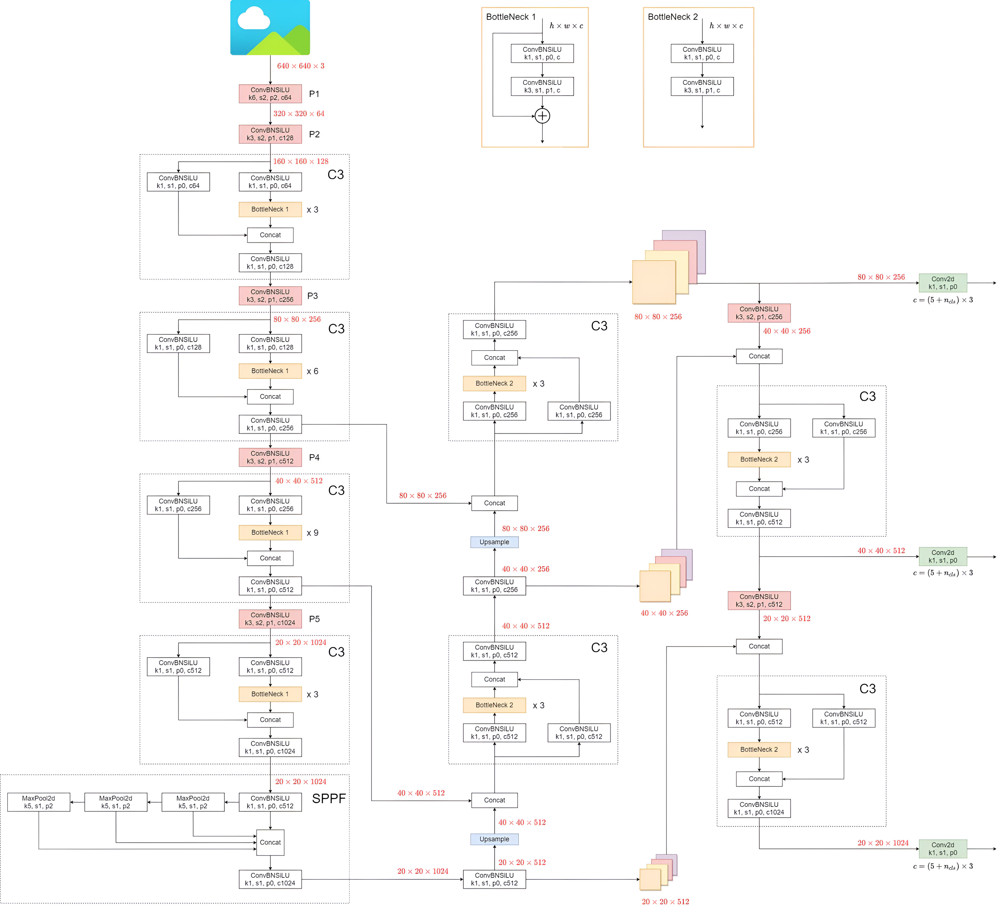
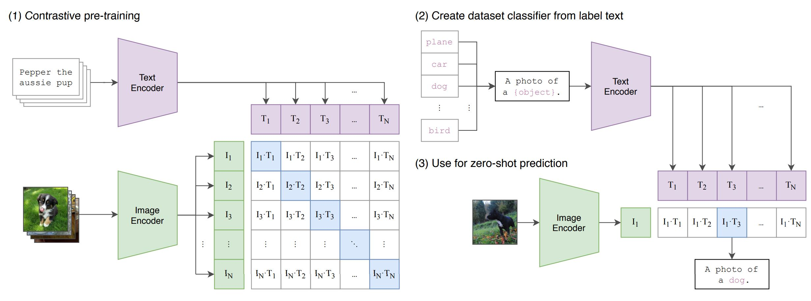
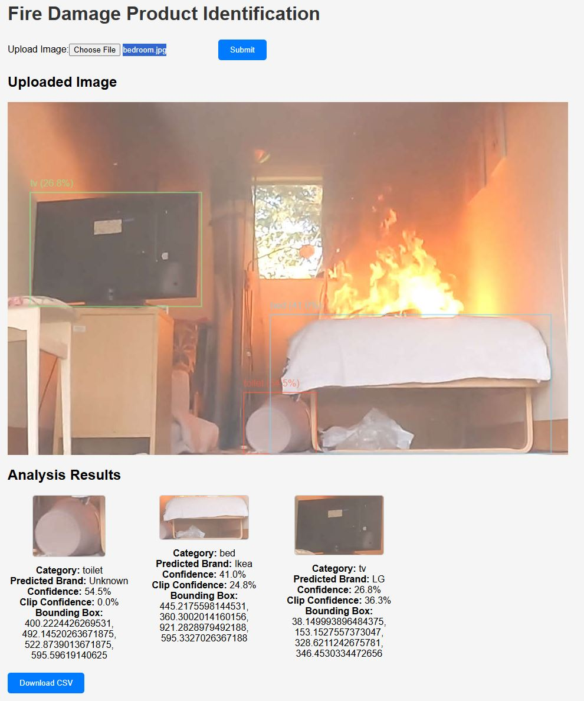
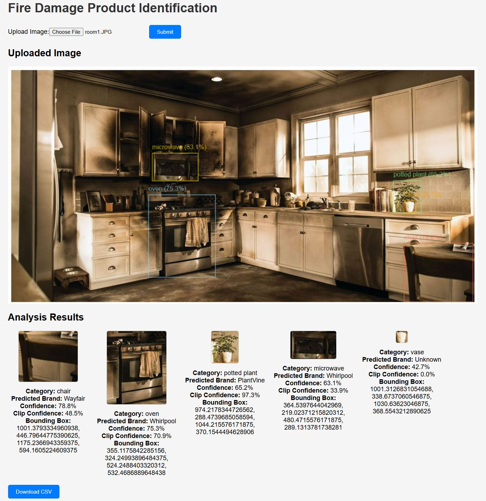

# Fire-Damage-Product-Idenfitication

This project identifies the fire damaged product from its image.

### Workflow

1. Object Detection and Classification with YOLOV5
2. Cropped Image of object passed to CLIP model
3. Prediction of manufacturer by CLIP

#### YOLOV5

#### CLIP Model

### Running on your machine

The system has REACT for frontend, and FASTAPI for the backend. In order to run both at the same time, write the following commands.

- For React: `npm start` inside the 'fire-damage-analysis' directory.

- For FASTAPI: `uvicorn main:app --reload`

### Results

#### 1. Normal Bedroom

#### 2. Room with more items

